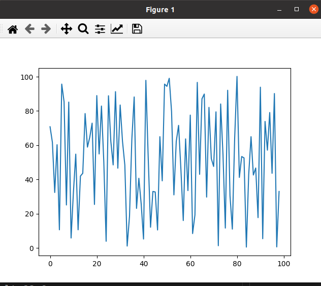
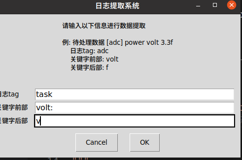

# Log prase system 日志解析系统

## Description

+ 此工程为基于python的日志解析系统，适用于使用rtthread的log日志系统。

+ 在使用rtthread的log时，输出的日志有很多，此工程完成对日志信息的提取并已图表的形式输出，方便进行数据分析。
  
  如以下数据:

```textile
  \ | /

- RT - Thread Operating System
  / | \ 3.1.1 build Nov 19 2018
  2006 - 2018 Copyright by rt-thread team
  msh >
  [task] adapter volt:70.8v
  [task] adapter volt:61.7v
  [task] adapter volt:32.4v
  [task] adapter volt:60.3v
  [task] adapter volt:10.6v
  [task] adapter volt:95.7v
  [task] adapter volt:85.4v
  [task] adapter volt:25.10v
  [task] adapter volt:85.2v
  [task] adapter volt:5.8v
  [task] adapter volt:32.6v
  ....
```

执行结果



## Usage

1. 需要python3环境支持 `pip install python`

2. 安装对应lib库支持
   
   + easygui: `pip install easygui`
   
   + re: `pip install re`
   
   + matplotlib: `pip install matplotlib`

3. 执行 log_parse.py文件 `python log_parse.py`

4. 根据图形界面提示信息填写关键字参数
   
   

5. 选择对应的日志文件

6. 程序将提取相应数据，并生成图表
   
   ---
   
   测试程序验证方法如下：
   
   1. 使用 log_generate.py 可以生成一个测试log，`python log_generate.py`
   
   2. 之后执行分析程序 `python log_parse.py`
   
   
   
   3. 选择刚刚使用log_generate.py 生成的log.txt，即可获得分析图表

## Compile

`python3`

## License

Follow the MIT license. Author @wanglei.

## Todo List

1. 针对不同文件进行测试
2. 针对提取数据类型为非浮点数类型数据测试
3. 异常处理